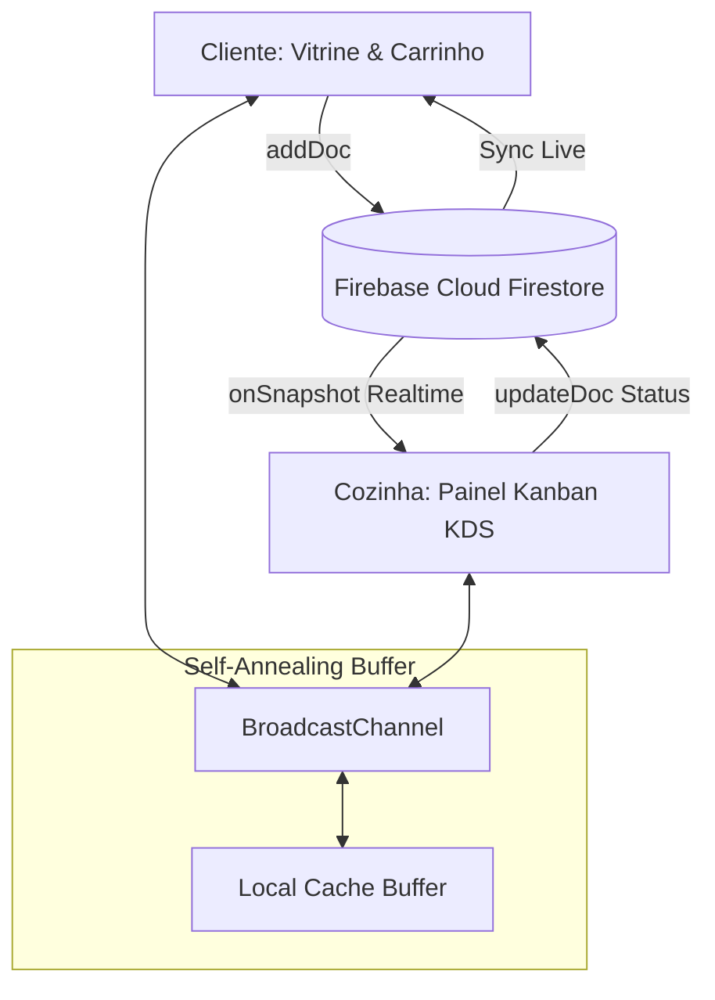

# 🏛️ Arquitetura do Sistema - BurguerSync Ourinhos

**Versão:** 2.5.5 | **Padrão:** Google Antigravity 3-Layer Architecture | **Ambiente:** SENAI Ourinhos

---

## 1. Visão Geral
O **BurguerSync** é uma plataforma full-stack moderna para pedidos em delivery e gestão de cozinha industrial em tempo real (Kitchen Display System - KDS).



---

## 2. A Arquitetura de 3 Camadas

### Camada 1: Diretivas (Estratégia & Lógica de Negócio)
* **Local:** `/directives/`
* **Regras de Negócio Fundamentais:**
  1. **Taxa de Entrega Fixa:** R$ 5,00 calculada estritamente sobre todos os pedidos.
  2. **Validação Obrigatória:** Nome completo, Telefone/WhatsApp, Endereço de entrega e ao menos 1 item na sacola.
  3. **Ciclo de Vida do Pedido:** 
     `[Recebido] ➔ [Em Preparo] ➔ [Saiu para Entrega] ➔ [Entregue]`
  4. **Formas de Pagamento Suportadas:** Pix Instantâneo (com QR Code e Copia e Cola), Cartão na Entrega, Dinheiro na Entrega com troco opcional.

---

### Camada 2: Orquestração (Inteligência & Sincronização)
* **Local:** `frontend/src/firebase-service.js` e `frontend/src/app.js`
* **Função:** Coordenação de fluxos de dados, gerenciamento de estado otimista (Optimistic UI), telemetria e recuperação de falhas (Self-Annealing).

---

### Camada 3: Execução (Ações Determinísticas)
* **Local:** Componentes de interface, triggers de transição de status no Firestore, renderização do DOM e scripts de automação.
* **Operações:**
  - `addDoc(collection(db, "pedidos"), payload)`
  - `updateDoc(doc(db, "pedidos", id), { status: newStatus })`
  - `onSnapshot(query(collection(db, "pedidos"), orderBy("horario", "desc")), callback)`

---

## 3. Schema de Dados do Firestore (`pedidos`)

```json
{
  "numero": "1045",
  "cliente": {
    "nome": "Rodrigo Carlos",
    "celular": "(14) 99876-5432",
    "email": "rodrigo@senai.br",
    "endereco": "Rua Brasil Imperial, 1042 - Ourinhos",
    "obsEntrega": "Apto 34B"
  },
  "itens": [
    {
      "nome": "Ourinhos Smash Burguer",
      "preco": 32.90,
      "quantidade": 2,
      "obsItem": "Ponto: Ao Ponto • Pão: Brioche • Sem cebola"
    }
  ],
  "pagamento": {
    "metodo": "Pix",
    "troco": null
  },
  "valores": {
    "subtotal": 65.80,
    "taxaEntrega": 5.00,
    "total": 70.80
  },
  "status": "Recebido",
  "horario": 1758898800000
}
```

---

## 4. Mecanismo de Resiliência (Self-Annealing)
1. **Fallback Silencioso:** Caso o Firestore encontre latência ou restrição de conexão, o sistema comuta automaticamente para o buffer reativo local via `BroadcastChannel` e `localStorage`.
2. **Sincronização Multi-Aba:** Clientes e Cozinheiros podem abrir abas separadas no navegador e testar a sincronização em tempo real instantaneamente sem refresh.
3. **Logs Determinísticos:** Eventos e erros são registrados no painel de telemetria e no arquivo `.tmp/error_logs.txt`.
